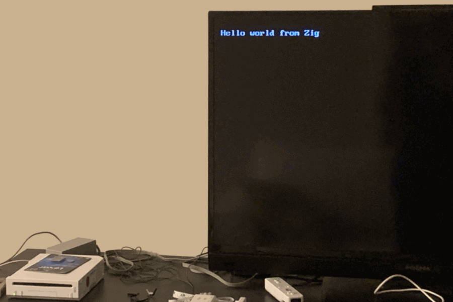

# zig-wii

This is a work-in-progress to compile Zig code on the Wii. Right now all of the
app code should be writable in Zig, but the devkitPPC toolchain is still needed
for linking in libc and OS primitives.
